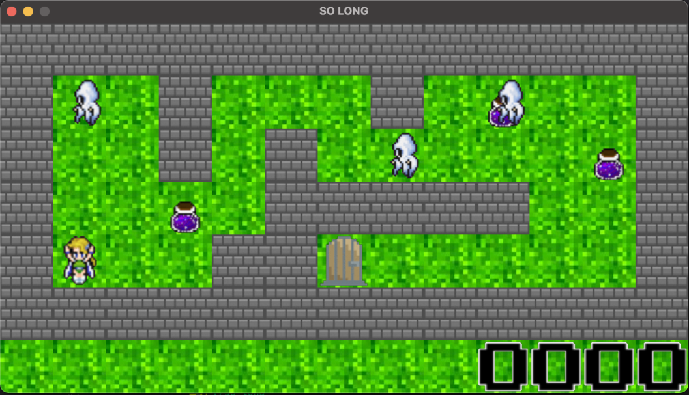

# 🕹️ so_long

**so_long** is a small 2D game built using **MiniLibX**, where the player moves through a map to collect items and reach the exit.  
This project is part of the **42 curriculum**, designed to teach basic **graphics rendering**, **event handling**, and **game logic** in C.

---

## 🎯 Objective

The goal is to create a simple 2D game where the player:
- Navigates through a map loaded from a `.ber` file.
- Collects all the collectibles before exiting.
- Avoids walls and invalid moves.
- Wins the game by reaching the exit after collecting everything.

---

## ⚙️ Main Features

- 🧩 **Map parsing** — reads and validates the `.ber` map file.  
- 🌄 **2D graphics** — renders tiles using the MiniLibX library.  
- 🚶 **Player movement** — moves with keyboard input (W, A, S, D).  
- 💎 **Collectibles system** — counts and removes collectibles as the player picks them up.  
- 🚪 **Exit detection** — checks if all collectibles are collected before allowing the exit.  
- ⚠️ **Error handling** — detects invalid maps, missing files, or invalid characters.  

---

## 🗺️ Map Rules

- The map must be **rectangular** and surrounded by **walls** (`1`).  
- It must contain:
  - `P` → One player start position  
  - `E` → One exit  
  - `C` → At least one collectible  
- Other valid characters:  
  - `0` → Empty floor  
  - `1` → Wall  

Example:
```
111111
1P0C01
1000E1
111111
```


---

## 📁 Project Structure
```

so_long/
├── src/ # Core source code
│ ├── game/ # Game logic and rendering
│ ├── map/ # Map parsing and validation
│ ├── player/ # Player movement and input
│ ├── utils/ # Helper functions
│ └── images/ # Texture loading
├── includes/ # Header files
├── maps/ # Example .ber maps
├── textures/ # Sprites and images
└── Makefile # Compilation rules
```

---

## 🚀 How to Run

```bash
make
./so_long maps/map.ber
